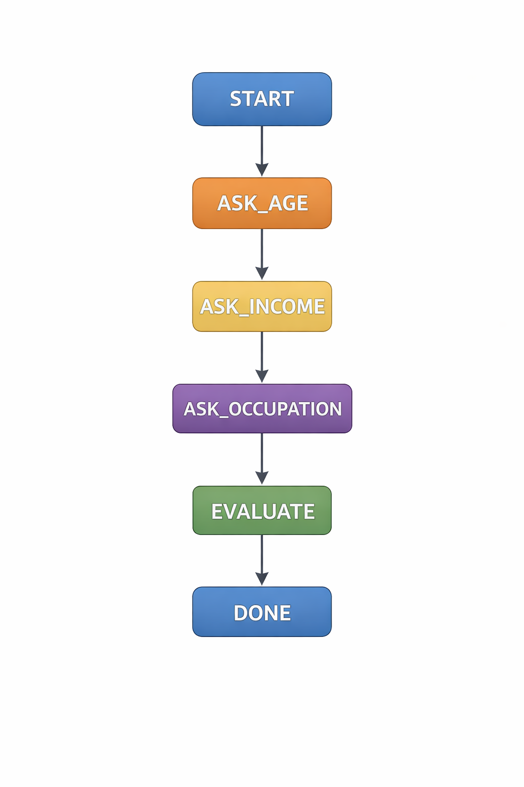
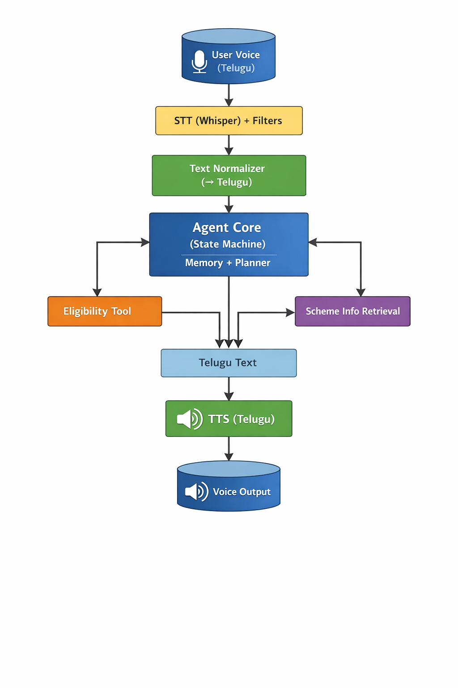

# 🎙️ Telugu Voice-Based Government Scheme Agent

A **voice-first agentic AI system** that helps users identify **eligible government and public welfare schemes** using **Telugu** as the primary interaction language. The system goes beyond a chatbot by reasoning across multiple voice turns, maintaining memory, invoking tools, and handling speech recognition failures.



---

## 📌 Problem Statement

Many citizens want to apply for government schemes but do not know:
- Which schemes they are eligible for
- What information is required
- How to access scheme details in their native language

This project addresses the problem using a **voice-only Telugu interface**, making it accessible to non-English speakers.

---

## 🗣️ Example User Request

> **"నాకు ప్రభుత్వ పథకాల వివరాలు కావాలి"**

The agent asks follow-up questions in Telugu, collects user details, evaluates eligibility, and responds **with spoken Telugu output**.



---

## ✨ Key Features

- 🎧 **Voice-first interaction** (speech input and speech output)  
- 🗣️ **End-to-end Telugu pipeline** (STT → Agent → TTS)  
- 🧠 **Agentic workflow** using a state machine  
- 🗂️ **Conversation memory** across turns  
- 🧰 **Multiple tools** for decision making  
- 🚨 **Failure handling** for unclear or missing speech  

---

## 🧠 Agent Workflow

The agent follows a structured, multi-step flow instead of a single prompt. It:
- Receives Telugu speech input from the user  
- Converts speech to text, reasons over state, and gathers missing details  
- Determines eligibility and generates a Telugu response, then speaks it back to the user

---

## 📂 Project Structure

```
voice_scheme_agent/
├─ src/
│  ├─ main.py          # Entry point
│  ├─ agent.py         # Agent logic and state machine
│  ├─ stt.py           # Speech-to-text integration
│  ├─ tts.py           # Text-to-speech integration
│  └─ tools/
│     ├─ schemes_db.py # Scheme rules / database
│     └─ eligibility.py# Eligibility computation
├─ data/
│  └─ schemes.json     # Scheme definitions and criteria
├─ images/
│  ├─ image1.png       # Architecture diagram
│  └─ image2.png       # User interaction flow
├─ requirements.txt    # Dependencies
└─ README.md           # Documentation
```

---

## ✅ Setup & Run

1. **Clone and enter the repo**
   ```bash
   git clone https://github.com/Saiteja140503/voice_scheme_agent.git
   cd voice_scheme_agent
   ```

2. **Create virtual environment (recommended)**
   ```bash
   python -m venv .venv
   source .venv/bin/activate   # On Windows: .venv\Scripts\activate
   ```

3. **Install dependencies**
   ```bash
   pip install -r requirements.txt
   ```

4. **Configure environment**
   Create a `.env` file or export environment variables for any STT/TTS/LLM providers you use:
   ```
   STT_API_KEY=your_stt_key
   TTS_API_KEY=your_tts_key
   LLM_API_KEY=your_llm_key
   ```

5. **Run the agent**
   ```bash
   python -m src.main
   ```

---

## 🧪 Testing

If tests are present, run them with:

```bash
pytest
# or
python -m unittest
```

---

## 🛠️ Customization

- Update **scheme data** in `data/schemes.json` to add or modify schemes and criteria.  
- Change **Telugu prompts and responses** in `agent.py` (or prompts module).  
- Swap **STT/TTS backends** by editing `stt.py` and `tts.py`.  

---

## 🤝 Contributions

Contributions are welcome via issues and pull requests. Please describe changes clearly and keep them focused.

---

## 📜 License

Add your chosen license here (for example, MIT) and include a `LICENSE` file in the repository.
